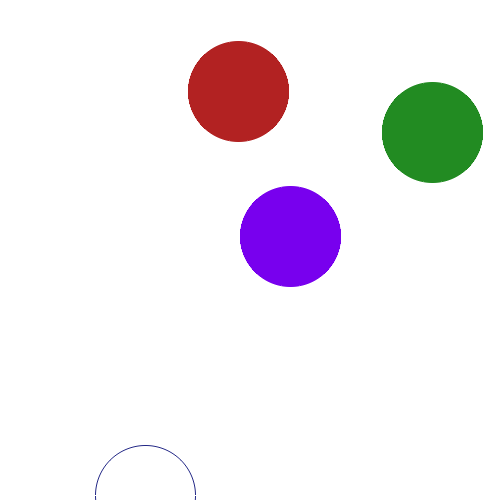
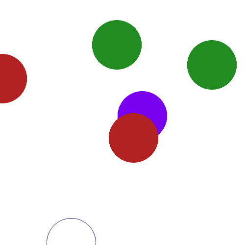
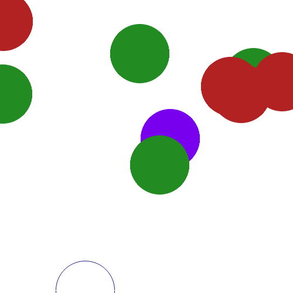
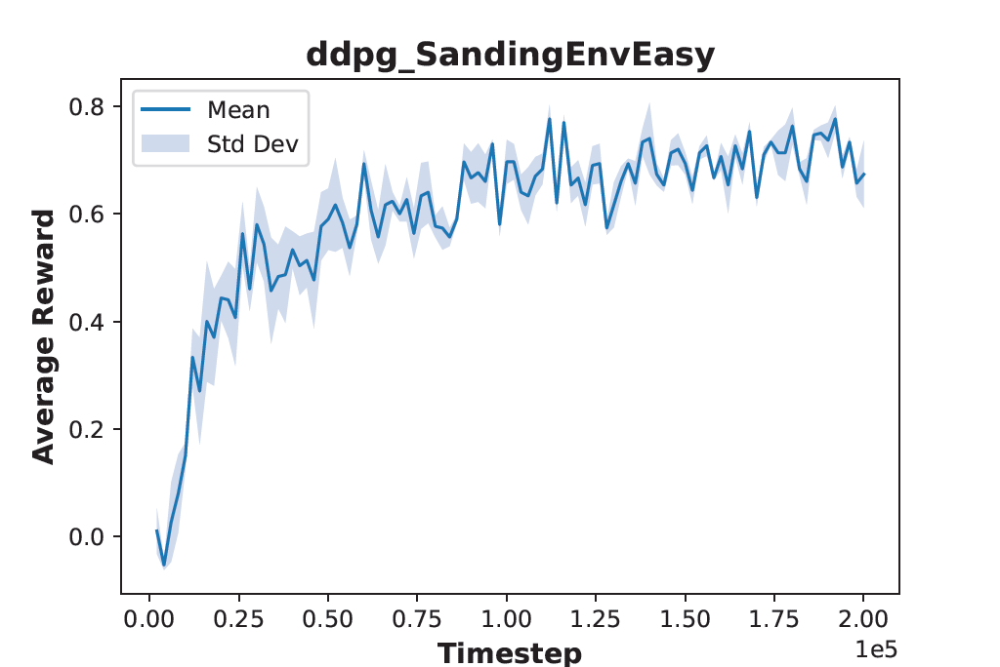
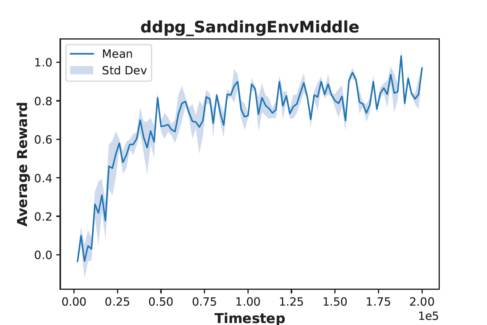
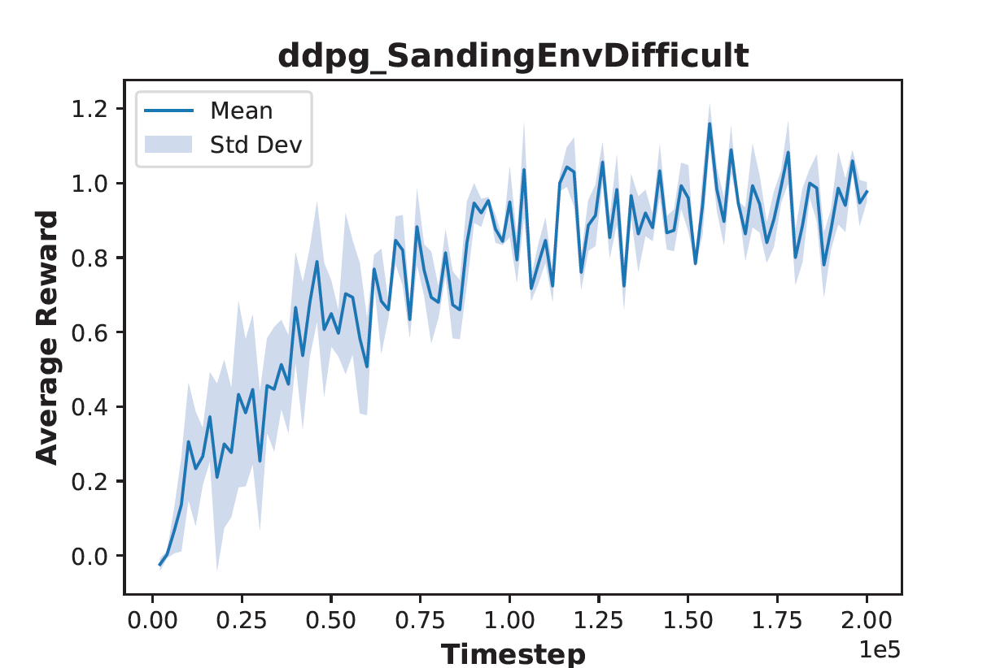
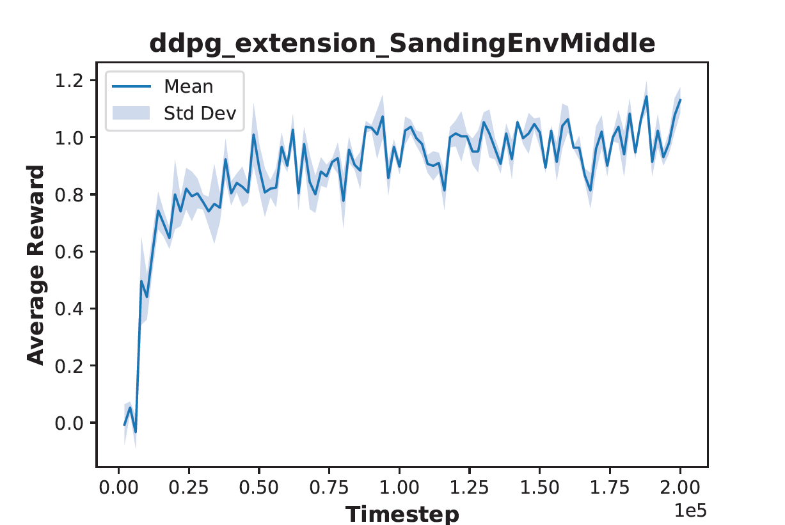
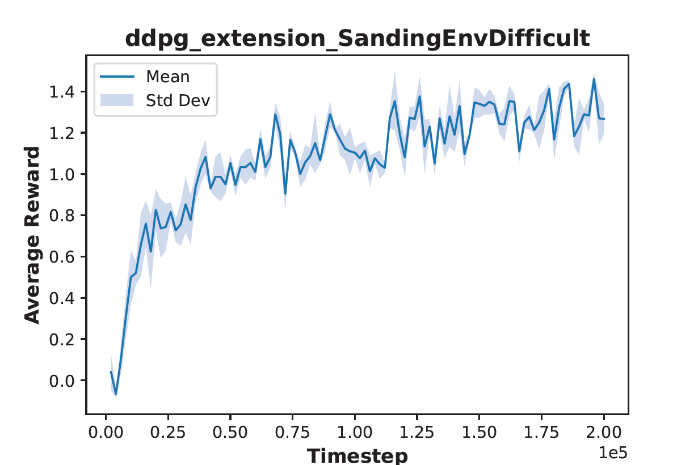
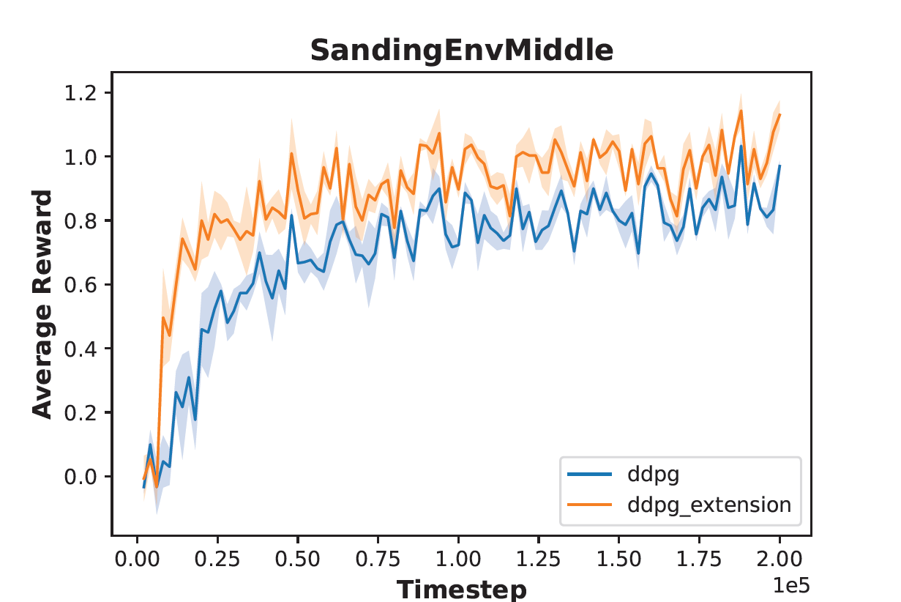
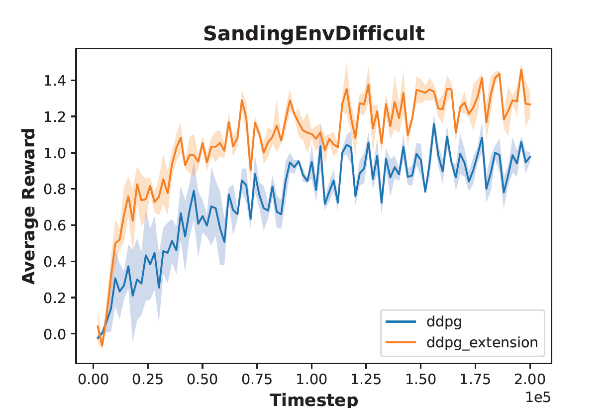

# Reinforcement Learning - Deep Deterministic Policy Gradient

## Table of Contents
1. [Project Overview](#1-project-overview)
2. [Development Tools](#2-development-tools)
3. [Visual Journey](#3-visual-journey)
4. [Implementation Highlights](#4-implementation-highlights)
5. [Demo](#5-demo)
6. [Bibliography](#6-bibliography)
7. [Authors](#7-authors)

## 1. Project Overview

This project was developed for submission in **Reinforcement Learning** course at **[Aalto University](https://www.aalto.fi/en/)**.

The main goal was to optimize the robot's behavior through deep reinforcement learning, ensuring that it efficiently sanding designated spots while avoids no-sanding areas. The project involves two main tasks:
1. **Basic DDPG Implementation**: Implement the Deep Deterministic Policy Gradient (DDPG) algorithm and run it in three sanding environments: easy, middle, difficult.
2. **DDPG Extension**: Extend the DDPG algorithm with Random Network Distillation (RND) to improve performance in middle and difficult environments.

### 1.1 System Overview
**Robot Characteristics**: The robot is represented as a purple circle with a radius of 10, operating on a 2D plane with x and y coordinates ranging from -50 to 50.

**Sanding & No-Sanding Areas**: Environments consist of sanding (green) and no-sanding (red) areas, each with a radius of 10. The configurations vary based on the task.

### 1.2 State Representation
The state space is represented as a list comprising the robot's current location, the locations of sanding areas, and the locations of no-sanding areas.

### 1.3 Action Space
Actions are represented as target coordinates for the robot arm, enabling it to navigate from its current position to the desired target. This movement is facilitated by a PD-controller, which carries a risk of overshooting.

### 1.4 Reward Definition
The reward function is based on the number of sanded sanding locations minus the number of sanded no-sanding locations, encouraging the robot to sand designated spots while avoiding no-sanding areas.

### 1.5 Difficulty Levels
Three difficulty levels are provided, each with varying numbers of sanding and no-sanding areas:

<div align="center">

| <div align="center">Easy<br>1 sanding spot<br> 1 no-sanding spot</div> | <div align="center">Middle<br>2 sanding spot<br> 2 no-sanding spot</div> | <div align="center">Difficult<br>4 sanding spot<br> 4 no-sanding spot</div> |
|------------------------------------|---------------------------------------|-----------------------------------------|
|  |  |  |

</div>

## 2. Development Tools

- **Development Environment**: Jupyter Notebook
- **Language**: Python 3.10
- **Libraries**:
    - **[PyTorch](https://pytorch.org/)**: An open-source deep learning framework that facilitates the development and training of neural networks.
    - **[Gymnasium](https://gymnasium.farama.org/index.html)**: An API standard for reinforcement learning with a diverse collection of reference environments.

## 3. Visual Journey

This section presents the achieved performance in terms of average reward using both DDPG and its extension across different environments.

<div align="center">

| <div align="center">DDPG - Easy Environment</div> |
|------------------------------------|
|  |

| <div align="center">DDPG - Middle Environment</div> | <div align="center">DDPG - Difficult Environment</div> |
|------------------------------------|---------------------------------------|
|  |  |

| <div align="center">DDPG Extension - Middle Environment</div> | <div align="center">DDPG Extension - Difficult Environment</div> |
|------------------------------------|---------------------------------------|
|  |  |

| <div align="center">DDPG vs. DDPG Extension - Middle Environment</div> | <div align="center">DDPG vs. DDPG Extension - Difficult Environment</div> |
|------------------------------------|---------------------------------------|
|  |  |

</div>

## 4. Implementation Highlights

**Highlight 1/3**: The core update mechanism of the basic DDPG algorithm. It involves computing critic and actor losses using current and target Q-values to optimize their current networks, and performs soft updates on target networks for improved training stability and convergence.
```python
def _update(self):
    # Get batch data
    batch = self.buffer.sample(self.batch_size, device=self.device)
    
    # batch contains:
    state = batch.state # shape [batch, state_dim]
    action = batch.action # shape [batch, action_dim]
    next_state = batch.next_state # shape [batch, state_dim]
    not_done = batch.not_done # shape [batch, 1]
    reward = self.reward_manipulation(batch)
    
    # Compute current q
    qs = self.q(state, action)
    
    # Compute target q
    qs_target = self.q_target(next_state, self.pi_target(next_state))
    qs_target = reward + self.gamma * (qs_target * not_done)
    
    # Compute critic loss
    critic_loss = F.mse_loss(qs, qs_target)

    # Optimize the critic network
    self.q_optim.zero_grad()
    critic_loss.backward()
    self.q_optim.step()

    # Compute actor loss
    actor_loss = -self.q(state, self.pi(state)).mean()

    # Optimize the actor network
    self.pi_optim.zero_grad()
    actor_loss.backward()
    self.pi_optim.step()
    
    # Update the target q and target pi using u.soft_update_params() function
    cu.soft_update_params(self.q, self.q_target, self.tau)
    cu.soft_update_params(self.pi, self.pi_target, self.tau)
            
    return {}
```

**Highlight 2/3**: A custom RND network class for DDPG extension is designed with three fully connected layers and ReLU activation functions. The neural network architecture comprises two hidden layers, each consisting of 64 units, followed by an output layer that produces the desired output dimension, which in this case corresponds to the action dimension.
```python
# Custom RNDNetwork class with three fully connected layers with ReLU activation functions
class RNDNetwork(torch.nn.Module):
    def __init__(self, input_dim, output_dim):
        super().__init__()
        self.feature = nn.Sequential(
            nn.Linear(input_dim + output_dim, 64),
            nn.ReLU(),
            nn.Linear(64, 64),
            nn.ReLU(),
            nn.Linear(64, output_dim)
        )

    def forward(self, state, action):
        x = torch.cat([state, action], 1)
        x = self.feature(x)
        return x
```

**Highlight 3/3**: The computation of the internal reward using the Random Network Distillation (RND) approach. It calculates the mean-squared error (MSE) loss between predictor and target features, updates the predictor network, and returns the scaled mean-centered internal reward.
```python
def calculate_internal_reward(self, batch):
    # Query features of the current state
    predictor_features = self.rnd_predictor(batch.state, batch.action)
    target_features = self.rnd_target(batch.state, batch.action)
    
    # Compute RND loss
    rnd_loss = F.mse_loss(predictor_features, target_features)
    
    # Optimize the predictor network
    self.rnd_optimizer.zero_grad()
    rnd_loss.backward()
    self.rnd_optimizer.step()
    
    # Calculate the mean-centered and clamped internal reward 
    with torch.no_grad():
        internal_reward = (rnd_loss - rnd_loss.mean()).clamp(-2, 2)
    
    # Return the scaled internal reward
    return self.rnd_coef * internal_reward
```

## 5. Demo

The project is not uploaded, and access to its contents is provided upon request.

## 6. Bibliography

The following academic papers were used to gather sufficient information and complete the project:

1. Burda, Y., Edwards, H., Storkey, A. J., & Klimov, O. (2018). Exploration by Random Network Distillation. CoRR, abs/1810.12894. [Read the paper](http://arxiv.org/abs/1810.12894).

## 7. Authors
- Ferenc Szendrei

[Back to Top](#reinforcement-learning---deep-deterministic-policy-gradient)
